## Prerequisite

#### The following OS should be used for testing
- Mac OS X
- Linux
- Windows 7

#### Testing IDE
- PyCharm CE
- Visual Studio Code

#### Project JDK
- Python 3.8


---
## Project Setup

- git clone https://gitlab.engr.illinois.edu/ziningc2/sp21-cs242-assignment2.git

- cd sp21-cs242-assignment2

- Open the project in PyCharm

- You should have a proper project structure looks like

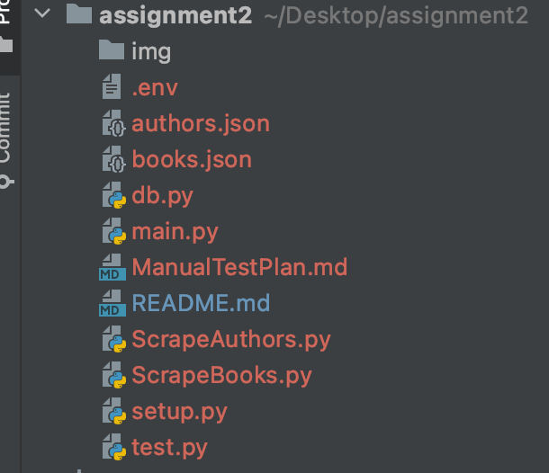

- Make sure you have the following installed

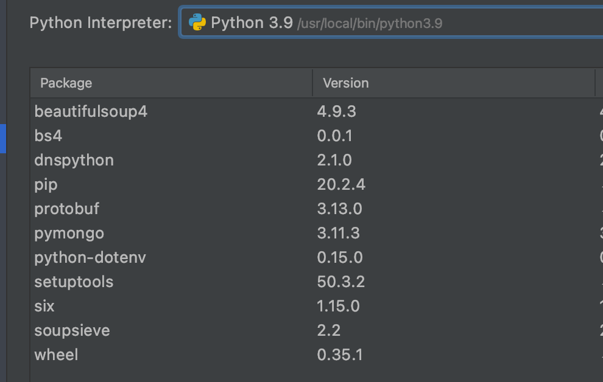

- You should also have MongoDB Compass downloaded for database access.
    https://www.mongodb.com/try/download/compass
  
- Open a terminal and start the project

---
## Manual Tests

### Command Line
- Enter ```python3 main.py -h```. The basic command line interface. 

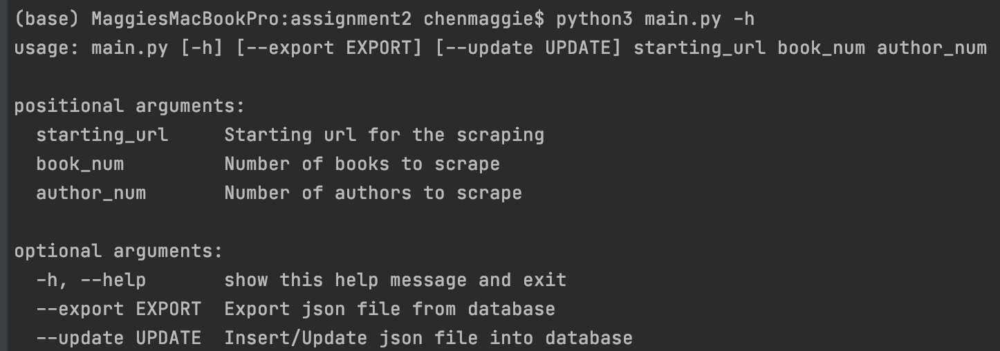

_We have positional arguments that user must input:_

**starting_url** is the starting point for web-scraping. It must be a book page.

**book_num** is the number of books that will be scraped from. It should be < 200.

**author_num** is the number of authors that will be scraped from. It should be < 50.

_We have positional arguments that user can choose to add:_

**--export EXPORT** is the flag if you want to export the data from database to JSON file.

**--update UPDATE** is the flag if you want to import JSON file to database.

- For example: 

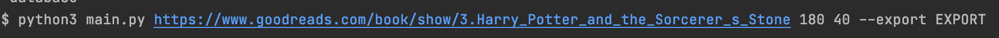

- Run the main.py

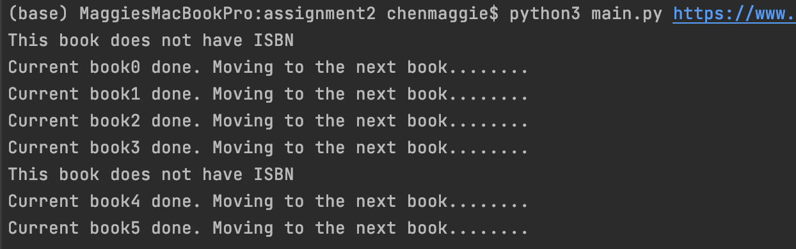

You should have following messages print out in the terminal. 
The web-scraping is ongoing.

### Accessing the database

- Connecting MongoDB via MongoDB Compass

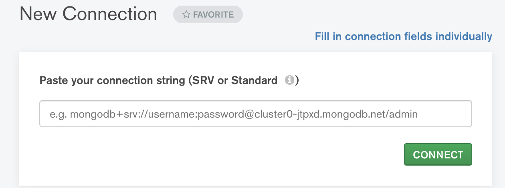

The connection string can be found in .env

- After connected to the MongoDB

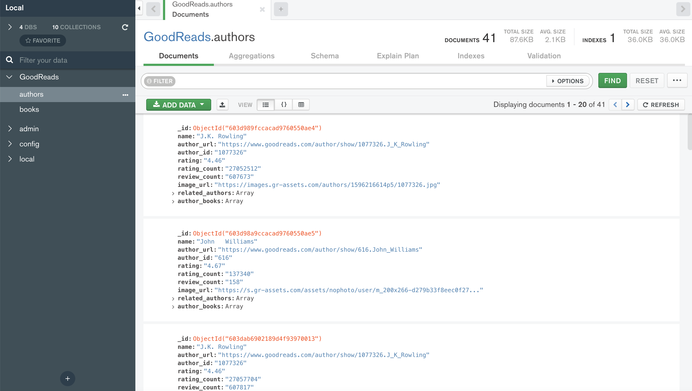

You should have a database called **GoodReads** and two collections: **authors**, **books**.
After the web-scraping is finished, the data scraped will be stored into a MongoDB.

### Exporting/Importing file into database

- The user specifies the flag to export/import the database

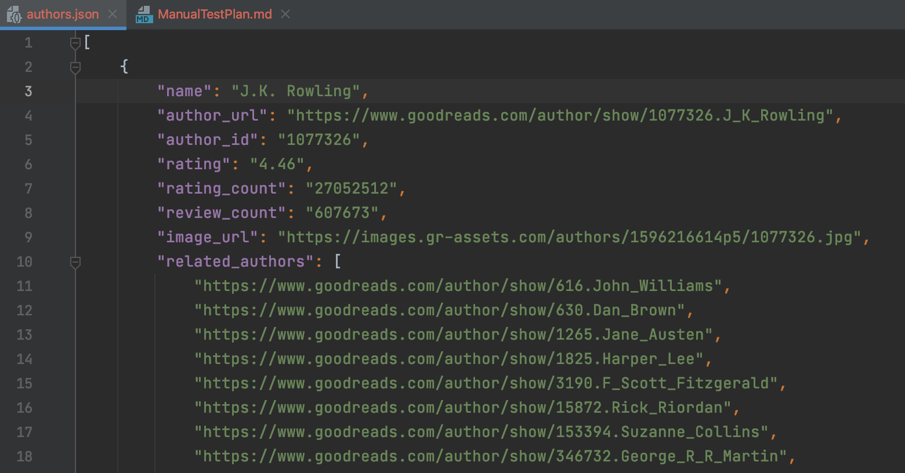

You should have files names authors.json, books.json look like this.
And the data would be exported from / imported into the MongoDB

### Errors handling

- If the user input an invalid staring url

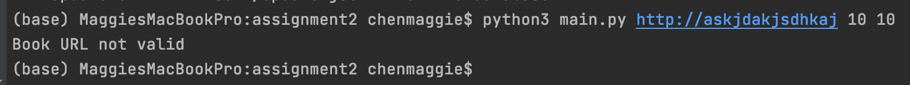

Error messages "Book URL not valid" would be generated, and the program would terminate.

- If the user input an invalid book_num ( > 200)

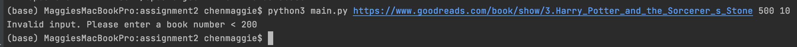

Error messages "Invalid input. Please enter a book number < 200" would be generated, 
and the program would terminate.

- If the user input an invalid author_num ( > 50)

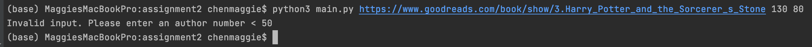

Error messages "Invalid input. Please enter an author number < 50" would be generated, 
and the program would terminate.