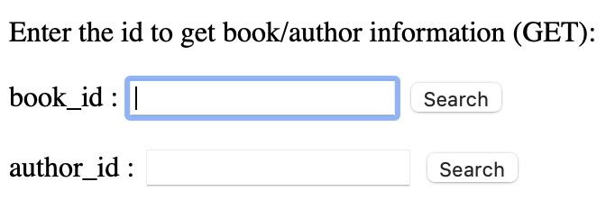
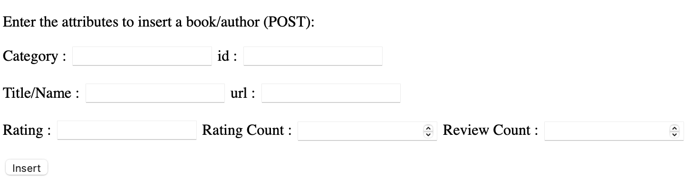

## Prerequisite

#### The following OS should be used for testing
- Mac OS X
- Linux
- Windows 7

#### Testing IDE
- Visual Studio Code

#### Project Requirement
- Python 3.8
- Flask
- JavaScript
- Html


---
## Project Setup

- git clone https://gitlab.engr.illinois.edu/ziningc2/sp21-cs242-assignment2.git

- cd sp21-cs242-assignment2

- Open the project in VSCode


- Make sure you have Flask installed and is up to date

    ```pip install Flask```
  
- Open a terminal and start the project

---
## Manual Tests
- To start the project, run the api using following command

    ```export FLASK_APP=api.py```

    ```flask run```

- You should be seeing this in terminal


- Then use the following url to see the html page http://127.0.0.1:5000/

- This is the main page


### Get Request

- **The first category is the GET request**



*We have book_id/author_id for user to input:*

- If you enter a valid book_id and click **Search**


You will have the search results for that book_id rendered. Including features with *book_url, title, book_id, ISBN, author_url, author, rating, rating_count, review_count, image_url, similar_books*.

- If you enter an invalid book_id that does not exist in the database


You will see the notification of error message.

- If you enter a valid author_id and click **Search**


You will have the search results for the author_id rendered. Including features with *name, author_url, author_id, rating, rating_count, review_count, image_url, related_authors, author_books*.

- If you enter an invalid author_id that does not exist in the database


You will see the notification of error message.


### Delete Request

- **The second category is the DELETE request**


*We have book_id/author_id for user to input:*

- If you enter a valid book_id and click **Delete**


You will be notified with the success message. And the book with this book_id is deleted from the database.

- If you enter an invalid book_id that does not exist in the database


You will see the notification of error message.

- If you enter a valid author_id and click **Delete**


You will be notified with the success message. And the author with this author_id is deleted from the database.

- If you enter an invalid author_id that does not exist in the database


You will see the notification of error message.


### Put Request

- **The third category is the PUT request**


*We have book_id/author_id and multiple fields for user to input:*

- If you enter valid book_id and attributes and click **Update**


You will be notified with the success message. And the above data will be updated to the corresponding book_id in database.

- If you enter a invalid book_id


You will see the notification of error message.

### Post Request

- **The last category is the POST request**



*We have multiple fields for user to input:*

- If you enter valid attributes and click **Insert**


You will be notified with the success message. And the above data will be inserted to the database.

- If there are some errors inserting the information

You will be notified with the error message "Failed to insert. Please try again".
